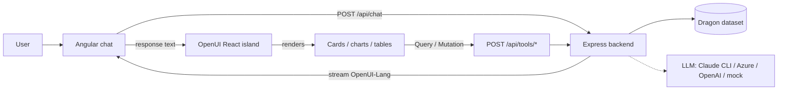

# 🐉 Ember & Scale — Generative UI Dragon Sanctuary

A demo of **Generative UI** built on a **modern Angular 22** base application, using
[**OpenUI**](https://www.openui.com/docs/openui-lang) to let an LLM compose the
interface itself — live cards, charts and reports — from a fun, self‑explanatory
dataset: a whimsical **dragon rescue sanctuary**.

You chat; the model answers with a purpose‑built UI instead of plain text.


---

## What it showcases

- **Small cards, reports & graphs, generated on demand** — the LLM emits
  [OpenUI‑Lang](https://www.openui.com/docs/openui-lang/specification-v05) and the
  OpenUI runtime renders real components (KPI cards, donut/line/bar charts, tables,
  callouts) and wires them to live data.
- **A fun data + functionality set** — dragons with elements, hoards, fire power,
  temperaments and rescue seasons, exposed through six tools the model can call.
- **Self‑explanatory example prompts** (click a chip to try):
  - 🔥 *"Show me the fire dragons as profile cards"*
  - 💰 *"Which element hoards the most treasure? Chart it"*
  - 📊 *"Build me a sanctuary dashboard"*
  - 🗓️ *"Give me a report of rescues across the seasons"*
  - 🏆 *"Who are the most powerful dragons? Let me sponsor one"* (interactive — the
    Sponsor button runs a **mutation** and refetches, no LLM round‑trip)

---

## Quick start

```bash
npm install
npm run dev
```

Then open **http://localhost:4200**.

`npm run dev` builds the OpenUI island, then runs the API (`:8787`) and the Angular
dev server (`:4200`, proxying `/api` to the backend) together.

> Out of the box `LLM_PROVIDER=claude` — it drives your **local Claude CLI**. Make
> sure you're logged in first (`claude login`, or export `ANTHROPIC_API_KEY`). No
> key is stored in this app; the CLI uses whatever auth it already has. Prefer a
> fully offline demo with zero setup? Set `LLM_PROVIDER=mock` (canned OpenUI‑Lang).

### Production‑style single process

```bash
npm run build      # builds the island + Angular into dist/
npm run serve      # Express serves the built app AND the API on :8787
# open http://localhost:8787
```

---
## Wiring an LLM (Claude CLI / Azure / local / OpenAI)

Copy `.env.example` → `.env` and set `LLM_PROVIDER`. The system prompt (component
library + tool specs) is generated in the browser by OpenUI and posted with each
request; the backend just forwards it to the model and streams the reply.

### Local Claude CLI (default)

Uses the `claude` binary (Claude Code) in non‑interactive print mode. The OpenUI
system prompt is passed via `--system-prompt-file` so it *overrides* Claude's
default agentic prompt — turning the CLI into a pure OpenUI‑Lang generator. Output
is streamed (`--output-format stream-json --include-partial-messages`).

```env
LLM_PROVIDER=claude
CLAUDE_MODEL=sonnet      # opus | sonnet | haiku | fable | …
```

Prerequisite: **be logged in** — run `claude login` once (or export
`ANTHROPIC_API_KEY`). The app adds no credentials of its own; if the CLI can't
authenticate you'll see the error rendered as a Callout in the UI.

### Azure OpenAI

```env
LLM_PROVIDER=azure
AZURE_OPENAI_ENDPOINT=https://<resource>.openai.azure.com
AZURE_OPENAI_DEPLOYMENT=<deployment-name>
AZURE_OPENAI_API_VERSION=2024-10-21
# Auth — pick ONE:
#   API key:
AZURE_OPENAI_API_KEY=<key>
#   ...or a locally logged-in identity: leave the key empty and run `az login`
#   (uses DefaultAzureCredential — works with managed identity in the cloud too)
```

### Local model (Ollama / LM Studio / vLLM — any OpenAI‑compatible endpoint)

```env
LLM_PROVIDER=openai
OPENAI_BASE_URL=http://localhost:11434/v1   # e.g. `ollama serve`
OPENAI_MODEL=llama3.1
OPENAI_API_KEY=ollama                        # any non-empty string
```

### Cloud OpenAI

```env
LLM_PROVIDER=openai
OPENAI_API_KEY=sk-...
OPENAI_MODEL=gpt-4o-mini
```

> A capable instruction‑following model gives the best Generative UI. Small local
> models may need coaxing; the `mock` provider is the reliable demo path.

---

## How it fits together

OpenUI's renderer is a **React** runtime (packages for React/Svelte/Vue — no Angular
one). Rather than reimplement its parser/runtime, the Angular app owns everything —
chat, layout, services, streaming, state — and mounts OpenUI's renderer as a tiny,
imperatively‑driven **React island** for just the generative‑UI surface.



1. **Angular** builds the system prompt via the island
   (`openuiLibrary.prompt({ tools, … })`) and streams `POST /api/chat`.
2. The **backend** forwards to the configured LLM and streams **OpenUI‑Lang** back.
3. The **island** (`@openuidev/react-lang` `Renderer` + `@openuidev/react-ui`
   components) parses the stream and renders. When the generated UI runs a
   `Query()`/`Mutation()`, a **tool function map** calls `POST /api/tools/:name` —
   no LLM round‑trip for interactions.

## Project layout

```
server/                 Express backend (run with tsx)
  data.ts               Dragon dataset + tool specs + handlers (source of truth)
  llm.ts                Provider hub: claude (default) | openai/local | azure | mock
  claudeCli.ts          Local Claude CLI provider (spawn + stream-json parse)
  mockResponses.ts      Offline OpenUI-Lang responses (also the smoke-test oracle)
  index.ts              /api/chat (stream) + /api/tools/* ; serves dist in prod
island/                 OpenUI React island (bundled to public/ by esbuild)
  index.tsx             window.OpenUIIsland = { buildSystemPrompt, render, unmount }
  build.mjs             esbuild bundle + react-ui CSS concat
src/app/                Angular 22 app (standalone, zoneless, signals)
  models.ts             Types + the OpenUIIsland global contract
  openui.service.ts     Loads the island, bridges its imperative API
  sanctuary.service.ts  Tool-spec fetch + streaming chat over fetch()
  genui.component.ts    Renders an OpenUI-Lang stream via the island
  chat.component.*      Chat window, example chips, thread
  app.*                 Shell
```

## Sanctuary tools (the "functionality set")

| Tool | Kind | Returns |
| --- | --- | --- |
| `list_dragons` | query | dragons, filterable by element / status |
| `sanctuary_stats` | query | headline KPIs (totals, avg fire power, hoard) |
| `element_breakdown` | query | per‑element counts, hoard, avg fire power |
| `rescues_by_season` | query | rescue/sponsor counts across seasons |
| `top_dragons` | query | top N by firePower / hoardValue / wingspan |
| `sponsor_dragon` | mutation | sponsor a dragon (changes state) |

## Tech

Angular 22 (standalone, zoneless, signals) · OpenUI (`@openuidev/react-lang`,
`@openuidev/react-ui`, `@openuidev/lang-core`) · React 19 island via esbuild ·
Express · local Claude CLI · OpenAI SDK + `@azure/identity`.
